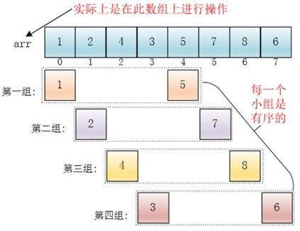

# Comparison-of-sorting-algorithms
## 用C语言实现各种排序算法的比较
### 具体要求如下
利用随机函数产生200000以上的随机整数，对这些整数采取多种方法进行排序，并显示排序结果，比较相关排序算法的效率。

（1）为了提高效率，所产生的随机数保存在一维数组S中，供各排序算法共用

（2）每次排序之前，都从数组S复制到数组R，针对数组R排序

（3）每种排序之后，应调用一函数，检验数组R是否真正有序

（4）在下面的两组排序方法中，每一组至少选择2个，总共不少于5个，对上面的随机数分别进行排序。

第一组：①直接（或折半）插入排序；②希尔排序；③冒泡排序；④简单选择排序

第二组：①快速排序；②堆排序；③归并排序

（6）对待排序数据的个数进行多组测试，在每一组测试中，记录每一种排序所耗费的时间

### 排序算法图示
---
**折半插入排序**

---
**希尔排序**

---
**冒泡排序**

---
**快速排序**

---
**堆排序**

---
**归并排序**

